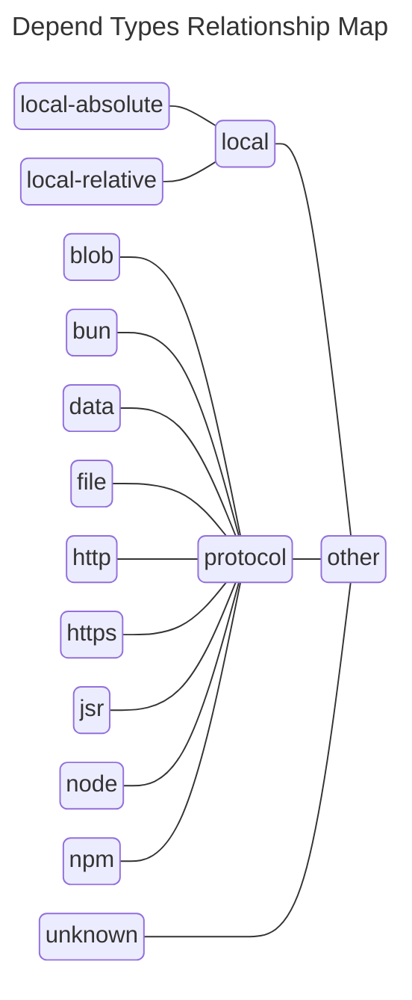

# `hugoalh/sort-depends`

Sort [`import`][ecmascript-import] statements and [`export`][ecmascript-export] statements with depend.

## 🔧 Options

### `exportFirst`

`{boolean = false}` Whether the `export` statements should locate before the `import` statements.

### `ignoreExport`

`{boolean = false}` Whether to ignore `export` statements, and only sort `import` statements.

### `map`

`{(RuleSortDependsDependType | RuleSortDependsMapContext)[] = [ "unknown", "protocol", "local", "other" ]}` Map of the depend type order.

- `"blob"`
- `"bun"`
- `"data"`
- `"file"`
- `"http"`
- `"https"`
- `"jsr"`
- `"local-absolute"`
- `"local-relative"`
- `"local"`
- `"node"`
- `"npm"`
- `"other"`
- `"protocol"`
- `"unknown"` (e.g.: from imports map)



### `mapOrderDefault`

`{RuleSortDependsSortOrder = "ascending"}` Default sort order of the depend type order map.

- `"ascending"`
- `"descending"`
- `"keep"`

This property may inherit by `RuleSortDependsMapContext.order`.

### `mix`

`{boolean = false}` Whether to mix sort `export` statements and `import` statements together.

### `reverse`

`{boolean = false}` Whether to reverse the order.

## ✍️ Examples

- ```ts
  /* ❌ INVALID */
  import { c } from "./c.ts";
  import { b } from "./b.ts";
  import { a } from "./a.ts";

  /* ✔️ VALID */
  import { a } from "./a.ts";
  import { b } from "./b.ts";
  import { c } from "./c.ts";
  ```
- ```ts
  /* ✔️ VALID */
  import { a } from "./foo.ts";
  import { b } from "./foo.ts";
  import { c } from "./foo.ts";
  ```

[ecmascript-export]: https://developer.mozilla.org/en-US/docs/Web/JavaScript/Reference/Statements/export
[ecmascript-import]: https://developer.mozilla.org/en-US/docs/Web/JavaScript/Reference/Statements/import
